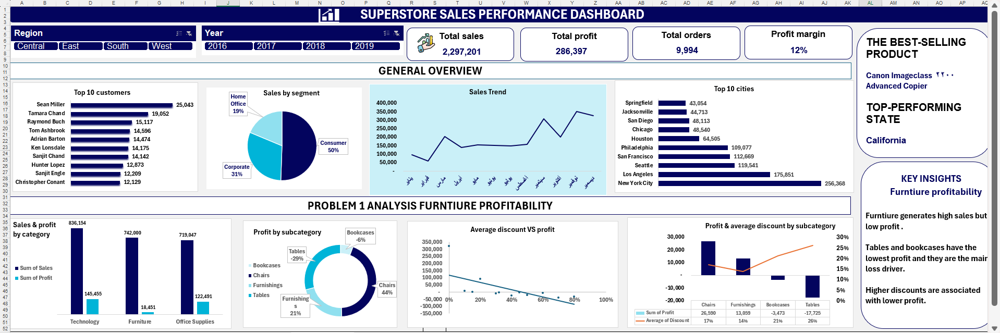

# Superstore Sales Performance Dashboard

An interactive Excel dashboard analyzing Superstore sales performance, profitability, customers, products, regions, and discount impact.

## 📊 Project Overview

This project focuses on analyzing Superstore sales data to understand overall business performance and identify key factors affecting profitability.

The dashboard provides an interactive overview of sales, profit, orders, customers, products, and regional performance.

## 🛠️ Tools Used

- Microsoft Excel
- Pivot Tables
- Pivot Charts
- Slicers
- Data Analysis
- Data Visualization

## 📈 Dashboard Features

- Total Sales
- Total Profit
- Total Orders
- Profit Margin
- Sales by Segment
- Sales Trend
- Top 10 Customers
- Top 10 Cities
- Profit by Category and Subcategory
- Average Discount vs. Profit
- Profit and Discount by Subcategory
- Regional and Yearly Filtering

## 🔍 Key Insights

- Total sales reached **2,297,201**, with total profit of **286,397**.
- The Consumer segment accounts for **50% of total sales**.
- **California** is the top-performing state.
- **Furniture** generates strong sales but relatively lower profit compared with other categories.
- **Tables and Bookcases** show negative profitability and represent important areas for further investigation.
- Higher discounts are associated with lower profit, highlighting the importance of monitoring discount levels.

## 🎯 Business Objective

The main objective is to provide a clear view of sales and profitability performance and help identify areas that may require further analysis or improvement.

## 📷 Dashboard Preview

